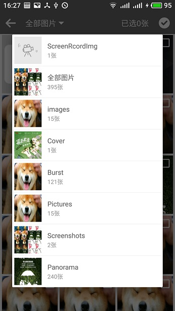
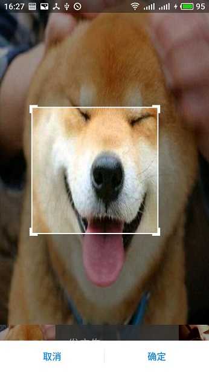

# Android相册选择，拍照库

### 基本介绍
####  链式调用，本地相册选择，支持多选，单选，压缩，裁剪，批量压缩，裁剪,适配Android6.0,7.0权限

    还有一些细节后续再完善补充，作者后期打算使用自己的这套库，并持续更新优化。

### 如何使用

#### Android Studio
    第一步：
      在项目的gradle里配置
      allprojects {
      		repositories {
      			...
      			maven { url 'https://jitpack.io' }
      		}
      	}

      第二步：
      在module的gradle里配置
      dependencies {
      	        compile 'com.github.shajinyang:PhotoPicker:1.1.0'
      	}

### 使用示例

#### 快速使用（默认单选，不压缩，不裁剪）
    PhotoPicker.Album(mContext)
                    .setOnResultListener(new OnResultListener() {

                        @Override
                        public void onSucess(ArrayList<String> imagePathList) {
                            //todo 返回图片的绝对路径集合
                        }
                        @Override
                        public void onCancel() {

                        }
                    })
                    .start();

#### 常规使用
    PhotoPicker.Album(mContext)
                .setMultiChooseSize(6)//设置最大选择数量
                .setIsCompress(true)//是否压缩
                .setIsCrop(false)//是否裁切
                .setOnResultListener(new OnResultListener() {

                    @Override
                    public void onSucess(ArrayList<String> imagePathList) {
                        //todo 返回图片的绝对路径集合
                    }
                    @Override
                    public void onCancel() {

                    }
                })
                .start();

#### 自定义UI细节
    PhotoPicker.Album(mContext)
            .setMultiChooseSize(6)//设置最大选择数量
            .setIsCompress(true)//是否压缩
            .setIsCrop(false)//是否裁切
            .setExitIco(resId)//设置返回图标按钮
            .setStateBarColor("#ffffff")//设置状态栏颜色
            .setToolBarColor("#ffffff")//设置toolbar颜色
            .setOnResultListener(new OnResultListener() {

                @Override
                public void onSucess(ArrayList<String> imagePathList) {
                    //todo 返回图片的绝对路径集合
                }
                @Override
                public void onCancel() {

                }
            })
            .start();

### 感谢 [Luban压缩](https://github.com/Curzibn/Luban) [Cropper裁切](https://github.com/edmodo/cropper)

